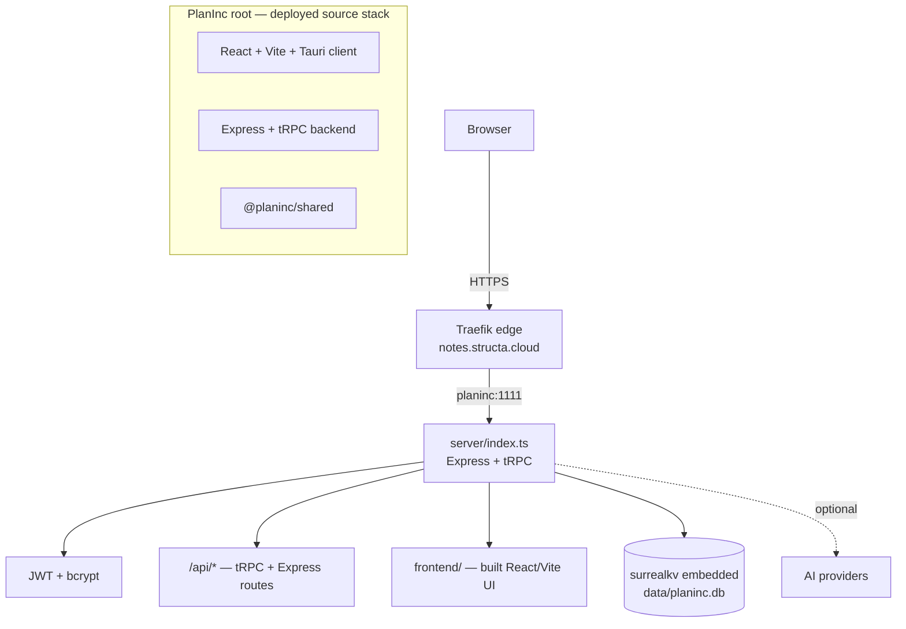

# Architecture (PI-003)

> Part of **PlanInc** — AI-powered card note-taking and planning

## Two codebases, one deployed

The repository root holds the deployed source stack. It combines the React/Vite client with the
Express/tRPC server and embedded SurrealDB.



## The deployed source stack

`server/index.ts` composes the deployed Express server and provides:

1. **Static UI** — the built React/Vite bundle from `frontend/`.
2. **Typed API** — tRPC procedures under `/api/trpc`.
3. **Express integrations** — auth, file, RSS, OpenAI, plugin, and MCP routes.
4. **Health** — `/health` (used by the edge and deployment checks).

State lives in an **embedded SurrealDB** over `surrealkv://`, opened from
`PLANINC_DB_FILE` (default `./data/planinc.db`). There is no external
database container any more — see [`PI-005`](./04-database-and-schema.md).

## Django alternative

The migration target is documented as an executable phase plan in
[`PI-015`](./plans/django-bolt/00-index.md). Django will become the application
boundary, django-bolt will provide typed API/read surfaces, django-fusion will
preserve render-first fragments, PostgreSQL will become the system of record,
Redis will support Channels and workers, and the existing React/Vite/Tauri
client will migrate incrementally.

The current Express/SurrealDB stack remains the deployed source of truth.
The Django implementation is isolated in
[`django_server/`](../django_server/) and is not a replacement deployment yet.
Only the remaining import, parity, rollback, and cutover gates in `PI-018`
justify a future production switch.

The first Django implementation is isolated at
[`django_server/`](../django_server/). It currently provides settings, ASGI
bootstrapping, request IDs, health/readiness, tenant lifecycle commands,
tenant context lookup, and the initial tenant/domain registry without changing
the deployed Compose service.

## Request flow

```
Request → Express router → resolve workspace/auth scope
        → SurrealQL statement(s) on the embedded engine
        → inlineValue() serialisation → JSON or HTML fragment
```

Record links are serialised by `inlineValue()`, which must handle SurrealDB's
`RecordId` explicitly. That detail is load-bearing — see
[`PI-005`](./04-database-and-schema.md) and
[`PI-010`](./09-troubleshooting.md).

## Why the active source stack remains

The root source tree is the deployment target: the React client owns the
component library, and the TypeScript backend owns the AI provider abstraction,
jobs, MCP bridge, and embedded datastore integration.

## Related

- [`PI-004`](./03-runtime-http-api.md) — HTTP surface
- [`PI-005`](./04-database-and-schema.md) — database
- [`PI-006`](./05-deployment.md) — deployment topology
- [`PI-015`](./plans/django-bolt/00-index.md) — target Django architecture and execution phases
