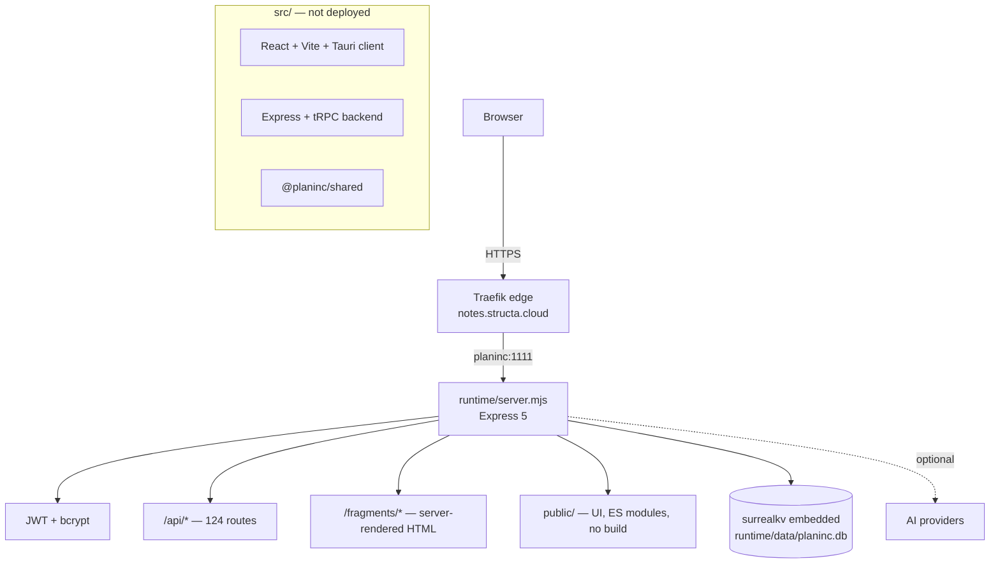

# Architecture (PI-003)

> Part of **PlanInc** — AI-powered card note-taking and planning

## Two codebases, one deployed

The repository holds a deployed application (`runtime/`) and the upstream
monorepo it was extracted from (`src/`). The deployed application is a
**deliberately minimal rewrite**: it keeps the domain surface (notes, tickets,
chat, study, AI policy, workspaces) but drops the build toolchain in favour of a
single Express server and vanilla ES modules.



## The runtime

`runtime/server.mjs` is a single Express 5 module that provides:

1. **Static UI** — `runtime/public/` served as-is; `index.html` plus ES modules.
2. **REST API** — `/api/*`, 124 routes across auth, notes, attachments,
   categories, chat, tickets, study, workspaces, AI policy, providers and audit.
3. **Fragments** — `/fragments/*` returning HTML for partial updates.
4. **Sharing** — `/share/:id` and `/share/:id/raw` for public note links.
5. **Files** — `/files/:id/:name` serving stored attachments.
6. **Health** — `/health` (used by the edge and by `make test-canonical`).

State lives in an **embedded SurrealDB** over `surrealkv://`, opened from
`SURREALDB_FILE` (default `runtime/data/planinc.db`). There is no external
database container any more — see [`PI-005`](./04-database-and-schema.md).

## Request flow

```
Request → Express router → resolve workspace/auth scope
        → SurrealQL statement(s) on the embedded engine
        → inlineValue() serialisation → JSON or HTML fragment
```

Record links are serialised by `inlineValue()`, which must handle SurrealDB's
`RecordId` explicitly. That detail is load-bearing — see
[`PI-005`](./04-database-and-schema.md) and
[`PI-010`](./09-troubleshooting.md).

## Why the upstream monorepo is retained

`src/` is where feature work is designed: the React client has the component
library, the tRPC backend has the AI provider abstraction, jobs and MCP bridge.
The runtime is the deployment target. When the two disagree, **the runtime is
the contract** — it is what users actually hit.

## Related

- [`PI-004`](./03-runtime-http-api.md) — HTTP surface
- [`PI-005`](./04-database-and-schema.md) — database
- [`PI-006`](./05-deployment.md) — deployment topology
