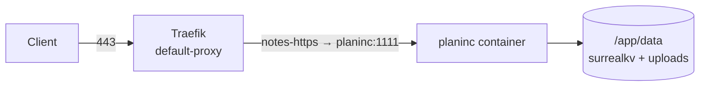

# Deployment (PI-006)

> Part of **PlanInc** — AI-powered card note-taking and planning

PlanInc is served at **`notes.structa.cloud`** by a dedicated Traefik vhost
defined in the proxy repo (`proxy/configs/traefik/dynamic/notes.yml`). This
repository owns the container; the proxy repo owns TLS and routing.



## Networks — the step that is easy to miss

Traefik resolves backends **by container name on a shared network**. The
`planinc` container must therefore join the proxy's `common` network, or every
request returns 502 even though the vhost config is correct.

`external` in compose is a **boolean**, and the network name is a separate
variable. Deploy like this:

```bash
# one-time, if the shared network does not exist yet
docker network create common

PLANINC_EXTERNAL_NETWORK=true PLANINC_NETWORK_NAME=common make deploy
```

…or set both in `.env` (which is what the deployed instance does):

```ini
PLANINC_EXTERNAL_NETWORK=true
PLANINC_NETWORK_NAME=common
```

With both unset, compose creates a project-scoped `planinc-network` instead —
fine for a local run, but Traefik will not see it.

> `PLANINC_EXTERNAL_NETWORK=common` is **invalid** and fails with
> `invalid boolean: common`. The value selects nothing; `PLANINC_NETWORK_NAME`
> selects the network.

## Deploying

```bash
make setup                       # .env from .env.example (first time only)
$EDITOR .env                     # superuser, JWT secret, networks, public URL
make deploy                      # validate + build + up
```

`make deploy` is `build up`, and both run `verify-surrealdb` first as a
pre-flight check on the embedded engine.

## Verifying the deployment

```bash
curl -fsS https://notes.structa.cloud/health
PLANINC_TEST_URL=https://notes.structa.cloud make test-canonical
```

Health endpoint, container health check and `make test-canonical` all use
`/health`, so it stays dependency-light.

## Persistence and volumes

| Container path | Host path | Contents |
| --- | --- | --- |
| `/app/data` | `./data` | `planinc.db` (surrealkv) + `uploads/` |
| `/app/context` | `${PLANINC_CONTEXT_DIR:-../../..}`, read-only | project tree the AI chat may read |

**Back up `data/`.** It is the persistent application state for the source stack. There is no
database container to dump.

## Environment notes

Inside the container compose sets `SURREALDB_FILE=/app/data/planinc.db`, and the
server reads the listen port from **`PLANING_PORT`** (note the spelling — it
predates the `PLANINC_` prefix, and `.env.example`'s `PLANINC_PORT` is the *host*
port mapping, not the in-container port).

> **Known gap:** `.env.example` documents `PLANINC_DB_FILE`, but nothing wires it
> through `docker-compose.yml` — `SURREALDB_FILE` is hardcoded there. Setting
> `PLANINC_DB_FILE` has no effect in Docker. It is honoured only by `make run`
> (native), which passes the environment straight through.

## Related

- [`PI-007`](./06-secrets-and-superuser.md) — `.env` and the superuser
- [`PI-008`](./07-testing.md) — the canonical smoke test
- [`PI-010`](./09-troubleshooting.md) — 502s and certificate problems
