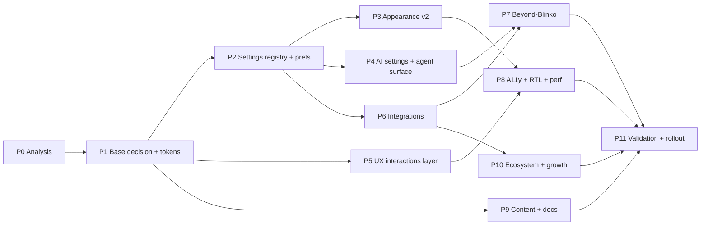

# Blinko Parity, Design System & UX Program (PI-011)

> Part of **PlanInc** — AI-powered card note-taking and planning

**Goal:** analyse the open-source **Blinko** project (design system, the AI
settings surfaced from the agent page, settings surfaces, integrations), decide
the **design-system base** (current HeroUI vs **shadcn/ui** vs **FlyonUI**),
then plan the integrations, features, UX/interaction upgrades and appearance
settings PlanInc should ship — plus the **skills and content work** needed to
execute it.

This document is an **implementation-complete, ordered plan**. Phase 0 produces
the evidence (parity matrix); Phases 1–11 are sequenced with explicit
dependencies, skills, file targets and exit criteria.



---

## 1. Reference: what Blinko actually is

Verified anchors (extend in Phase 0; do not re-derive):

| Anchor | Value |
|---|---|
| Repo | `github.com/blinkospace/blinko` — TypeScript, self-hosted, "AI-powered card note-taking" |
| Top level | `app/` (React + Vite + Tauri, `app/src-tauri/`), `server/`, `install.sh`, Docker image |
| Platforms | macOS / Windows / Linux / Android via Tauri |
| Docs sitemap | `docs.blinko.space/sitemap.xml` (EN + ZH trees) |

Docs areas (all slugs verified):

- **AI:** `how-to-use/ai/{ai-setting,ai-chat,ai-search,ai-tag,ai-writing,ai-emoji,ai-post-processing}`
- **Settings:** `settings/{preference,webhook,access-token,link-account,sso,s3,task}`
- **Ecosystem:** `ecosystem/{blinko-plugin,blinko-hub,wechat-bot}`, `plugins/{get-started,api-reference,setting-panel,store,publish-plugin}`
- **Capture:** `desktop/{quick-note,quick-ai,text-selection,autostart}`, `android/{share,shortcuts}`
- **Content:** `how-to-use/{rss,daily-review,music,share-your-note,tags,toolbar}`

### 1.1 Blinko AI settings (the "AI settings modal" pattern)

Verified from `how-to-use/ai/ai-setting`:

1. **Enable AI** toggle.
2. **Provider** — OpenAI, Azure OpenAI, Anthropic, DeepSeek, Gemini, Grok, Ollama, OpenRouter.
3. **Model** per provider, with inline recommended models.
4. **API key** + optional **custom endpoint**.
5. **Embedding settings** — embedding model, *separate* embedding key + endpoint.
6. **Index rebuild** — incremental vs **Force Rebuild**, with the model-change warning.
7. **Embedding dimensions** — auto-detect known models, manual for custom.
8. **Search optimisation** — `Embedding Top K` (1–20, rec. 3–5), `Embedding Score` (0.0–1.0, rec. 0.4–0.7), **rerank model**, `Rerank Top K`, `Rerank Score`, `Use Embedding Endpoint`.
9. **HTTP proxy**.
10. **Test Connection**.

Worth copying is the *structure*: progressive disclosure in one surface (basic →
embedding → retrieval tuning → network → verify), inline recommendations, and a
destructive-action warning bound to index rebuild.

### 1.2 Blinko appearance / preference settings

Verified from `settings/preference`:

- **Theme:** light / dark / **system** + **theme colour palette**, applied instantly.
- **Language:** applied immediately.
- **Mobile:** auto-hiding navigation bar.
- **Content display:** order by create time, **text fold length** (default 500), **card columns** (mobile 1–2 / tablet 2–4 / desktop 2–6), **time format**, **max home page width** (0 = full), **page size** (30), **toolbar visibility**.
- **Animation:** background animation toggle (performance escape hatch).
- **Custom background:** user-built gradients for login and share pages.

### 1.3 Blinko integrations

| Integration | Evidence | Shape |
|---|---|---|
| **Webhooks** | `settings/webhook` | `note.create` / `note.update` / `note.delete`; JSON payload with note + attachments; guidance on HTTPS-only, signature verification, IP allow-list, timeouts |
| **Access tokens + REST API** | `settings/access-token` | JWT token, `POST /api/v1/note/upsert`, OpenAPI browser at `/api-doc` |
| **Plugin marketplace** | `ecosystem/blinko-plugin`, `plugins/*` | Browse → install → **permission prompt** → per-plugin settings panel (`window.Blinko.api`) → uninstall; publish flow |
| **Hub / bots** | `ecosystem/{blinko-hub,wechat-bot}` | Hub + chat-bot ingestion |
| **RSS** | `how-to-use/rss` | Feed ingestion |
| **Share links** | `how-to-use/share-your-note` | Public share with password |
| **Desktop/mobile capture** | `desktop/*`, `android/*` | Tray quick-note, quick-AI, text-selection capture, Android share + shortcuts |
| **MCP** | 3rd-party `mcp-server-blinko` | External MCP server writing notes via an API token |
| **Identity/storage** | `settings/{sso,link-account,s3}` | SSO, account linking, S3 |

---

## 2. Baseline: PlanInc today (verified in this checkout)

Path root: `application/tools/PlanInc/`.

| Area | Current implementation |
|---|---|
| Frontend stack | React **18.3.1**, Vite **6**, TypeScript 5.6, **Tailwind v4.1.4**, **HeroUI 2.8.0-beta.1**, MobX 6, React Router v7, Vditor 3.11.2, i18next 25 |
| Interaction libs present | `@dnd-kit/*` (core/sortable/utilities), `react-beautiful-dnd-next` (legacy), `framer-motion` + `motion`, `react-hot-toast`, `echarts`, `@headlessui/tailwindcss` |
| Notable absences | **no command-palette lib** (`cmdk`), **no virtualization lib** (`@tanstack/react-virtual`), no Radix primitives |
| Backend | Node/Express + **tRPC**, **SurrealDB embedded** (`surrealkv://`, no DB container), Bun |
| AI | Mastra agents (`BaseChatAgent`, `TagAgent`, `EmojiAgent`, `RelatedNotesAgent`, `CommentAgent`, write agent) in `server/aiServer/`; litellm + MiniMax providers; `mcp/McpToolBridge`; Tavily web tools; RAG via `@mastra/rag` |
| AI settings UI | `components/PlanincSettings/AiSetting/` — `AiSetting.tsx`, `ProviderCard`, `ProviderDialogContent`, `ModelDialogContent`, `DefaultModelsSection`, `EmbeddingSettingsSection`, `GlobalPromptSection`, `AiPostProcessingSection`, `AiToolsSection`, **`McpServersSection`**, `AIIcon`, `constants` |
| Agent surface | AI settings modal opens from the composer (`PlanincAi/aiInput.tsx` imports `AiSetting`); **agent directories** (`working` + `skills`, reorder/enable) in `AgentDirectorySetting.tsx` (tables `agentDirectories`) |
| Other settings | `BasicSetting`, `BrandSetting`, `CategorySetting`, `ExportSetting`, `FormFieldSetting`, **`HotkeySetting`** (Tauri `get_registered_shortcuts`), `HttpProxySetting`, `ImportAIDialog`, `ImportSetting`, `MusicSetting`, **`PerferSetting`**, **`PluginSetting`**, `SSOSetting`, `ShareApprovalSetting`, `StorageSetting`, `TaskSetting`, `UserSetting`, `AboutSetting` |
| Appearance today | `PerferSetting.tsx` composes `Common/Theme/ThemeSwitcher`, `Common/LanguageSwitcher`, `Common/FontSwitcher`, palettes, and feature switches |
| Plugins today | `PluginSetting.tsx` + `store/plugin/pluginManagerStore`, `PluginRender`, install/upgrade/uninstall |
| Deployment | `notes.structa.cloud` → Traefik `default-proxy` → `planinc:1111`; data at `/app/data` (surrealkv + uploads); repo mounted read-only for chat context |

**Consequence:** PlanInc is already at/above Blinko for MCP management, agent
workspaces and drag-and-drop. The program below targets *parity gaps*, *real
differentiators*, and *systematic* design + interaction upgrades — not a rewrite.

---

## 3. Design-system base: HeroUI vs shadcn/ui vs FlyonUI

This is the highest-leverage decision in the programme and the reason it sits in
Phase 1, before any UI work.

### 3.1 What each option actually is

| Option | Nature | Theming model | Evidence |
|---|---|---|---|
| **HeroUI 2.8.0-beta.1** *(current)* | React component library (styled primitives, controlled props, a11y built in) | Provider + theme config, Tailwind plugin | Present in `app/package.json`; HeroUI docs |
| **shadcn/ui** | **Copy-in** React components over Radix primitives; you own the source | **CSS variables** → semantic tokens (`background/foreground`, `card`, `primary`, `muted`, `accent`, `destructive`, `border`, `input`, `ring`, `sidebar-*`, `chart-1..5`) exposed via Tailwind v4 `@theme inline`; dark mode by overriding the same tokens under `.dark`; derived `--radius-*` scale | shadcn *Theming* docs; *Tailwind v4* docs; CLI v4 + registry + MCP server |
| **FlyonUI** | **Semantic CSS classes** (daisyUI) + **headless JS plugins** (Preline); framework-agnostic, MIT, 800+ components, unlimited themes, RTL support | Theme presets/CSS variables via Tailwind plugin | FlyonUI *Introduction* docs; FlyonUI GitHub |

### 3.2 Evaluation matrix

Scored for **PlanInc specifically** (React 18 + Tailwind v4 + MobX + HeroUI
already shipping), not in the abstract.

| Criterion | HeroUI (keep) | shadcn/ui | FlyonUI |
|---|---|---|---|
| React ownership of state | Native, controlled props | Native (Radix) | Weak — vanilla JS plugins own DOM state, fights React/MobX |
| Accessibility | Built in | Built in (Radix/APG patterns) | "Unstyled & accessible plugins", less React-idiomatic |
| Theme token contract | Coarser | **Best-in-class** semantic token naming; the de-facto industry convention | Good (theme presets) |
| Tailwind v4 fit | Plugin-based | **Native** (`@theme inline`, `@custom-variant dark`) | Plugin-based (daisyUI layer) |
| RTL / i18n | Manual | `Direction` component | **Explicit RTL support** |
| Component breadth for a note app | Good; missing Command/Kbd/Resizable/Sidebar | Excellent for shell + command palette (`Command`, `Kbd`, `Sidebar`, `Data Table`, `Resizable`, `Direction`) | Very broad (incl. ApexCharts/FullCalendar/Flatpickr integrations) |
| Migration cost from today | Zero | High if wholesale; **low if adopted per-primitive copy-in** | Highest (different paradigm) |
| Upgrade/ownership risk | Pre-1.0 beta line | You own vendored code; CLI/registry updates are opt-in | Upstream churn; class-based theming |
| Agent/tooling ecosystem | Standard | CLI v4, registry, **MCP server**, `llms.txt`, skills — best agent ergonomics | Figma design system; weaker agent tooling |

### 3.3 Recommendation

1. **Do not rewrite the component layer.** Keep **HeroUI** as the React
   primitive base (a11y + controlled components + zero migration cost), and treat
   the beta line as a tracked risk (§8).
2. **Adopt the shadcn token contract** (CSS variables + `@theme inline` +
   `.dark` overrides + derived `--radius-*`) as PlanInc's theme model. This is a
   *convention* adoption — it works under HeroUI/Tailwind v4 and is the single
   largest maintainability win in the programme.
3. **Adopt shadcn components selectively** (copy-in, no runtime dependency) where
   HeroUI has no equivalent and the app shell needs them: **Command** (palette),
   **Kbd**, **Sidebar**, **Resizable**, **Direction** (RTL), **Data Table**.
   This is per-primitive, reversible, and does not commit the whole app.
4. **Use FlyonUI as an additive semantic CSS layer only** — it is now enabled
   through Tailwind v4's `@plugin "flyonui"` directive and pinned in
   `frontend/package.json`. Use its semantic classes for isolated, markup-led
   surfaces where they reduce duplication. Keep React-owned state, overlays,
   and application primitives on Radix/HeroUI; do not load FlyonUI's headless
   JavaScript plugins into the React tree.
5. **Revisit only on a trigger:** if HeroUI's beta line blocks a release, or if
   shell primitives become the bottleneck, escalate to a proper shadcn migration
   (own decision, own phase).

### 3.4 What each option unlocks (features/UX on the table)

| Unlocked capability | From | Where it lands |
|---|---|---|
| Semantic token system + dark/system parity | shadcn theming model | Phases 1, 3 |
| Command palette + `Kbd` hints | shadcn `Command`/`Kbd`, `cmdk` | Phase 5 |
| Collapsible shell (sidebar/rail/resizable inspector) | shadcn `Sidebar`/`Resizable` | Phases 1, 5 |
| RTL-correct first-class direction | shadcn `Direction`, FlyonUI RTL | Phase 8 |
| Theme-preset gallery / unlimited themes | FlyonUI theming model | Phase 3 |
| Data-dense tables (sessions, audit, webhook logs) | shadcn `Data Table` | Phases 6, 7 |
| Block-editor affordances around Vditor | both (as patterns) | Phases 4, 5 |

---

## 4. Skill & content execution map

PlanInc is a **React/Mastra** product, so the Django-oriented repo skills
(`structa-backend`, `django-perf-review`) do **not** apply. Load these:

| Phase | Skills to load | Why |
|---|---|---|
| P0 Analysis | `context7` (upstream APIs), `website-screenshot` (Blinko/AppFlowy evidence), `human-review` (review the matrix) | Evidence gathering + review loop |
| P1 Base + tokens | **`design-system-tokens`**, `shadcn`, `context7` | 3-tier token architecture + semantic contract |
| P2 Registry | `design-system-tokens`, `documentation-and-adrs` (record the settings schema decision) | Schema + ADR |
| P3 Appearance v2 | **`design-taste-frontend`**, `redesign-existing-projects` (audit-first), `design-system-tokens` | Appearance panel redesign without slop |
| P4 AI settings/agent | `context7` (Mastra/model APIs), `api-documentation-generator`, `design-taste-frontend` | Accurate provider/agent UX |
| P5 UX interactions | `gpt-taste` (motion/scroll discipline), `high-end-visual-design`, `minimalist-ui`, `playwright-best-practices` | Interaction quality + tests |
| P6 Integrations | **`mcp-builder`**, `api-documentation-generator`, `documentation` | Ship the MCP server + token API docs |
| P7 Beyond-Blinko | **`antv-g6-graph`** (graph/backlinks), `explore-data` (retrieval quality), `python-observability` (cost/latency metrics patterns) | Graph layer + AI observability |
| P8 A11y/RTL/perf | `playwright-best-practices`, `design-system-tokens`, `website-screenshot` | Keyboard/RTL/visual evidence |
| P9 Content + docs | **`content-production`**, `content-strategy`, `documentation-writer`, `writing-documentation-with-diataxis`, `structa-doc-authoring`, `structa-docs`, `api-documentation-generator` | Docs + release/marketing content |
| P10 Ecosystem | `content-strategy`, `brandkit`, `imagegen-frontend-web`, `image-to-code` | Marketplace/launch assets |
| P11 Release | `full-output-enforcement` (complete output), `human-review`, `playwright-best-practices` | No half-finished code; review gates |

**Content-writing workstream (P9) deliverables:**

| Artefact | Audience | Skill | Notes |
|---|---|---|---|
| In-app microcopy + empty states | end users | `content-production` | Every new setting needs a label + help line, translated (PI-009 gate) |
| AI settings explainers ("what is rerank?", "why rebuild the index?") | end users | `documentation-writer` | Blinko ships none — differentiator |
| Integration quick-starts (token, webhook, MCP, RSS) | developers | `api-documentation-generator` + Diátaxis how-to | Pair every integration with a copy-pasteable example |
| REST/token reference | developers | `api-documentation-generator` | Reference-type docs, OpenAPI-backed |
| Release notes / changelog per phase | users + community | `content-production` | Sourced from the parity matrix |
| Plugin authoring guide + permission model | plugin devs | `documentation-writer` | Mirrors Blinko's publish flow, stricter permissions |
| Migration/upgrade notes (appearance v2 is a visual change) | existing users | `content-production` | Required if §9 decision 2 is "visual reset" |

---

## 5. Feature / UX / interaction / integration backlog (sourced)

Each row is a candidate with provenance. `Δ` = what PlanInc can do better.

### 5.1 Features

| Feature | Source | PlanInc note |
|---|---|---|
| Embedding top-K / score thresholds, rerank model + rerank thresholds | Blinko AI docs | Δ Graph+vector hybrid ranking in Phase 7 |
| Index rebuild (incremental + force) with progress | Blinko AI docs | Δ Background job, resumable |
| Daily review | Blinko `how-to-use/daily-review` | Fits card-note model |
| RSS → note ingestion | Blinko `how-to-use/rss` | Add tag mapping + dedupe |
| Note share links (password/expiry) | Blinko `how-to-use/share-your-note`; existing `PlanincShareDialog` | Reuse existing state machine |
| Webhooks (`note.*` events) | Blinko webhook docs | Δ HMAC signature + replay log by default |
| Personal access tokens + OpenAPI docs | Blinko access-token docs | Prerequisite for all integrations |
| Plugin permissions + per-plugin settings panel | Blinko plugin docs/API ref | Δ Enforce, don't just display |
| External MCP server for PlanInc | 3rd-party `mcp-server-blinko` | Δ Native, with graph search tools |
| Templates / starter notes | AppFlowy templates | Onboarding lever |
| Cover + icon on notes | AppFlowy document shell | Fits card notes |
| Backlinks / bidirectional links | AppFlowy, graph DB native | Δ SurrealDB graph edges |

### 5.2 UX & interaction enhancements

| Enhancement | Source / rationale | Status in PlanInc |
|---|---|---|
| **Command palette (Cmd/Ctrl-K)** | shadcn `Command`/`cmdk`; keyboard-first apps (AppFlowy/Notion-class) | **Missing** — no `cmdk` |
| **Keyboard navigation + shortcut hints in UI** | WAI-ARIA APG patterns; `Kbd` | Desktop hotkeys exist (`HotkeySetting`), in-app hints missing |
| **Virtualised note/tag lists** | TanStack Virtual | **Missing** — no virtualization lib |
| Slash-menu block editing | AppFlowy block editor | Vditor present; affordances missing |
| Collapsible shell + resizable inspector | shadcn `Sidebar`/`Resizable` | Partial |
| Density modes (comfortable/compact) | Blinko content-display settings; data-dense apps | Missing |
| Focus/zen mode | note-app convention | Missing |
| Optimistic UI + undo for destructive actions | UX best practice; `react-hot-toast` present | Extend existing toasts with undo |
| Offline/connectivity indicator | Tauri + embedded DB local-first | Missing |
| Motion discipline + reduced-motion respect | MDN `prefers-reduced-motion` | `motion` library present; no user-facing control |
| Drag-and-drop consolidation | `@dnd-kit` **and** legacy `react-beautiful-dnd-next` both present | Consolidate on dnd-kit |
| Bulk selection / multi-note actions | note-app convention | Missing |
| Split view / multi-pane | note-app convention | Missing |
| Inline AI affordances (rewrite/expand/tag in place) | Blinko `ai-writing`, `ai-post-processing`; PlanInc has agents | Δ Currently settings-centric |
| Global quick capture parity | Blinko desktop/android capture | Verify in Phase 0 |

### 5.3 Integration candidates (ranked)

1. **Access tokens + documented API** (parity; unblocks everything) — Blinko access-token docs.
2. **Webhooks with signatures + delivery log** (parity, done properly) — Blinko webhook docs.
3. **PlanInc as MCP server** (parity, native) — MCP spec; `mcp-server-blinko` as prior art.
4. **MCP client hub hardening** (beyond) — existing `McpServersSection`/`McpToolBridge`.
5. **RSS ingestion** (parity).
6. **Share links** (parity).
7. **Plugin permission enforcement** (parity + Δ).
8. **Event bus reused by webhooks/plugins/agents** (beyond).
9. **Automation rules** (agentic workflows; beyond).
10. **Chat-bot bridge (Telegram/WeChat-class)** (optional, policy-dependent).
11. **Importers** (Obsidian/Notion/Markdown) — ecosystem growth.
12. **AI observability (cost/latency/tool traces)** (beyond).

---

## 6. Phase detail (implementation-complete)

### P0 — Analysis and parity matrix (no code)

**Status: SHIPPED** — the matrix is [`11-parity-matrix.md`](./11-parity-matrix.md)
(**PI-012**). See §11 phase log for what it changed.

**Deliverable:** a Blinko parity matrix doc (`docs/`, new PI-ID) with one row per
item in §1.1–1.3 and §5: `feature | Blinko evidence | PlanInc status | gap type
| target phase`; gap type ∈ {parity, better-than, differentiator, not-wanted}.

**Tasks** — inspect Blinko source for: (1) Tailwind/HeroUI theme setup and tokens,
(2) settings shell + section registry, (3) AI settings tree per §1.1, (4) the AI
entry point and which settings are inline, (5) `preference/webhook/access-token/
link-account/sso/s3/task`, (6) plugin API + permission model + webhook
dispatcher, (7) Tauri/Android capture surfaces vs `app/src-tauri/src/desktop/*`.
Blinko **source paths are unverified** — confirm before quoting.

**Skills:** `context7`, `website-screenshot`, `human-review`.

**Exit criteria:** every row has a PlanInc status and a phase; every *not-wanted*
row has a one-line rationale; matrix reviewed.

---

### P1 — Design-system base decision + token contract

**Status: SHIPPED (token contract + guardrails).** See §11 phase log for the
files, the verification evidence, and the residual items (shell primitives,
visual pass).

**Objective:** freeze the base decision (§3.3) and implement the token layer.

**Tasks**
1. Write the ADR recording the base decision (HeroUI kept; shadcn token contract
   + selective shadcn/Radix primitives; FlyonUI semantic CSS enabled without
   its headless JavaScript plugins).
2. Implement the 3-tier token architecture (global → alias → component) as CSS
   custom properties, exposed to Tailwind v4 via `@theme inline`, with light/dark
   as **alias remaps** (not component branches) and a derived `--radius-*` scale.
3. Map HeroUI theme config onto the alias tokens so existing components restyle
   without code changes; add a lint rule banning raw hex/px in components.
4. Add the shell primitives needed by later phases: `Command`/`Kbd`, `Sidebar`,
   `Resizable`, `Direction` (copy-in).

**Files:** `frontend/src/styles/*` (token sheets), `app/tailwind.config.*` /
CSS-first `@theme` block, `frontend/src/components/Common/Theme/*`, new
`frontend/src/components/ui/*` (vendored shadcn primitives), lint config.

**Skills:** `design-system-tokens`, `shadcn`, `context7`.

**Exit:** tokens documented + gallery renders; no raw colour literals in
components; light/dark/system all render; lint passes.

---

### P2 — Settings registry + preferences persistence

**Status: SHIPPED (registry + validation + proof).** The setting-level registry is
`shared/lib/settingsRegistry.ts`; the offline proof is
`frontend/scripts/check-settings-registry.mjs`. See §11 phase log.

**Objective:** one declarative place to declare, validate, persist and localise a
setting; per-account preference document with offline-first sync.

**Tasks:** schema (`id, section, type, default, scope, validation, i18nKey`);
generated settings UI; SurrealDB preference doc + local store merge
(last-write-wins); migrate existing `PerferSetting` switches into the registry
(keep old keys as read aliases); normalise the `PerferSetting`/`PreferSetting`
spelling.

**Skills:** `design-system-tokens`, `documentation-and-adrs`.

**Exit:** existing preferences load unchanged; new settings require no bespoke
code; a schema test proves round-trip.

---

### P3 — Appearance settings v2

**Status: SHIPPED (tokens + wiring; panel review pending).** Appearance v2 is
`frontend/src/lib/appearance.ts` + the `html[data-*]` rules in
`frontend/src/styles/globals.css`, driven by registry entries. See §11 phase log.

**Objective:** Blinko-parity-plus appearance panel, AppFlowy-style breadth.

**Groups:** Theme (mode/accent/surface contrast) · Typography (family, base-size
scale, line height, **editor vs UI font split**, mono) · Density & layout
(comfortable/compact, panel visibility, content max width, zen mode) · Content
(card columns per breakpoint, fold length, page size, sort order, time format) ·
Motion (reduce motion, background animation, transition speed) · Accessibility
(text direction RTL, contrast boost, focus ring, keyboard hints) ·
Personalisation (note background, login/share page background).

**Files:** `PerferSetting.tsx` → registry-driven sections; `Common/Theme/ThemeSwitcher`,
`Common/FontSwitcher`, new `AppearanceSection` components; tokens from P1.

**Skills:** `design-taste-frontend`, `redesign-existing-projects`,
`design-system-tokens`.

**Exit:** every §1.2 settings row covered (parity); typography scale, density,
RTL, focus/contrast, zen mode, motion controls shipped (Δ); all strings
translated (PI-009).

---

### P4 — AI settings + agent surface

**Objective:** §1.1 parity inside PlanInc's provider/agent model, reachable from
the agent surface.

**Tasks:** "Test Connection" (chat + embedding, latency); embedding dimension
auto-detect/manual + inline validation instead of a runtime throw; index rebuild
as a resumable background job with progress + the model-change warning; retrieval
tuning (top-K 1–20, score 0.0–1.0, rerank toggle + top-K/score, use-embedding-
endpoint); fold `HttpProxySetting` into an AI-scoped override; restructure the
composer modal into the §1.1 order with a link into `AgentDirectorySetting`;
per-agent tool policy (allow/deny, visible tool list, dry-run, activity log).

**Skills:** `context7`, `api-documentation-generator`, `design-taste-frontend`.

**Exit:** configure → verify → tune → rebuild without leaving the surface; no
reload required; agent tool policy enforced server-side.

---

### P5 — UX & interaction layer

**Objective:** keyboard-first, fast-feeling, note-app-grade interaction.

**Tasks:** command palette (`cmdk` via shadcn `Command`) wired to actions,
navigation and AI; in-app shortcut hints (`Kbd`) fed by `HotkeySetting`;
virtualise long lists (`@tanstack/react-virtual`); slash-menu + block
affordances around Vditor; collapsible shell + resizable inspector; density
modes; zen mode; optimistic UI + **undo** on destructive actions via
`react-hot-toast`; connectivity indicator; consolidate drag-and-drop on
`@dnd-kit` (retire `react-beautiful-dnd-next`); bulk selection + multi-note
actions; split view; inline AI affordances (rewrite/expand/tag in place).

**Skills:** `gpt-taste`, `high-end-visual-design`, `minimalist-ui`,
`playwright-best-practices`.

**Exit:** palette reachable from every surface; 100% of primary actions reachable
by keyboard; long-list scroll performance budget met; undo covers destructive
actions; dnd legacy dependency removed.

---

### P6 — Integrations

**Objective:** ship §5.3 items 1–7 + capture parity.

**Tasks:** scoped/revocable **access tokens**; OpenAPI spec + browser for the
Express surface; **webhooks** (note + conversation events, HMAC signature, retry
with backoff, delivery log + replay); **PlanInc MCP server** (notes, search, tags,
tasks, agent tools) per MCP spec; **RSS** ingestion with tag mapping/dedupe;
**share links** (password/expiry) on `PlanincShareDialog`; **plugin capability
manifests** (network/storage/note scope) with enforcement and review UI; verify
Tauri/Android quick-capture parity and fill gaps.

**Skills:** `mcp-builder`, `api-documentation-generator`, `documentation`.

**Exit:** a token can create a note end-to-end; a webhook fires on note
create/update/delete with a verifiable signature; an external MCP client can
search and write notes; quick-starts published (P9).

---

### P7 — Beyond-Blinko differentiators

**Objective:** win where the architecture differs, not where feature counts match.

1. **Graph knowledge layer** — relation edges (note → tag → mention →
   conversation → agent), backlinks panel, mention autocomplete, hybrid
   graph+vector ranking for "related notes".
2. **Agent workspaces product surface** — per-agent skills/working dirs, tool
   policy, dry-run, audit log, cost ceiling.
3. **Automation rules** — event-driven agent runs with visible run history.
4. **Offline-first + cross-device sync** (embedded DB is local-first already).
5. **AI observability** — cost/latency/model/tool trace in Task settings.

**Skills:** `antv-g6-graph`, `explore-data`, `python-observability`.

**Exit:** backlinks + hybrid ranking measurably beat vector-only on a held-out
query set; run history visible; cost per agent run attributable.

---

### P8 — Accessibility, RTL & performance hardening

**Tasks:** WCAG 2.2 AA audit across every new surface; full keyboard traversal
+ focus management in palette/dialogs; RTL audit with `Direction`; contrast and
focus-ring tokens honoured; `prefers-reduced-motion` + app motion switch;
list/scroll performance budgets; bundle-size check for vendored shadcn
primitives.

**Skills:** `playwright-best-practices`, `design-system-tokens`,
`website-screenshot`.

**Exit:** automated a11y checks green on all key routes; RTL screenshots reviewed
for LTR/RTL × light/dark × density; budgets enforced in CI.

---

### P9 — Content & documentation programme

**Status: PARTIAL** — the settings/appearance reference (PI-013), the phase-log
content, the P0 matrix and the 67 registry strings are shipped. Integration
quick-starts are **blocked on P6** landing; per-phase release notes accumulate in
§11. See the phase log.

**Deliverables:** the §4 content table — microcopy + empty states, AI explainers,
integration quick-starts, token/REST reference, per-phase release notes, plugin
authoring guide + permission model, appearance-v2 migration notes.

**Skills:** `content-production`, `content-strategy`, `documentation-writer`,
`writing-documentation-with-diataxis`, `structa-doc-authoring`, `structa-docs`,
`api-documentation-generator`.

**Exit:** every new user-facing string has copy + translation; each integration
has a working quick-start; docs index updated.

---

### P10 — Ecosystem & growth

**Tasks:** plugin marketplace surface (browse/install/permissions/settings/
review), plugin SDK + publish flow, templates/starter notes, importers
(Obsidian/Notion/Markdown), community-facing docs and launch assets.

**Skills:** `content-strategy`, `brandkit`, `imagegen-frontend-web`, `image-to-code`.

**Exit:** a third-party plugin can be published, installed and permission-scoped
without core changes; importers round-trip a real vault.

---

### P11 — Validation, release & rollout

```bash
cd application/tools/PlanInc
bun install && bun run dev:backend
make test                            # contract checks + hermetic Playwright suite
make test-canonical                  # smoke the running deployment on :1111
cd application/tools/PlanInc && python3 scripts/generate-dir-docs.py --check
```

Plus per release: rebuild + redeploy and verify the vhost (PI-006) — the app must
serve and `/health` must be 200; visual regression across light/dark/system ×
comfortable/compact × LTR/RTL; docs + INDEX updated; locale parity gate (PI-009).

**Skills:** `full-output-enforcement`, `human-review`, `playwright-best-practices`.

---

## 7. Complete execution order

| # | Phase | Depends on | Parallel with | Primary skills |
|---|---|---|---|---|
| 0 | Analysis & parity matrix | — | — | context7, website-screenshot |
| 1 | Base decision + token contract | P0 | — | design-system-tokens, shadcn |
| 2 | Settings registry + preferences | P1 | — | design-system-tokens |
| 3 | Appearance settings v2 | P2 | P4, P5 | design-taste-frontend, redesign-existing-projects |
| 4 | AI settings + agent surface | P2 | P3, P5 | context7, api-documentation-generator |
| 5 | UX & interaction layer | P1, P2 | P3, P4 | gpt-taste, high-end-visual-design |
| 6 | Integrations | P2 | P9 | mcp-builder, api-documentation-generator |
| 7 | Beyond-Blinko differentiators | P4, P6 | P8 | antv-g6-graph, explore-data |
| 8 | A11y, RTL & performance | P3, P5 | P7 | playwright-best-practices |
| 9 | Content & documentation | P1 | P6, P10 | content-production, documentation-writer |
| 10 | Ecosystem & growth | P6 | P9 | content-strategy, brandkit |
| 11 | Validation, release & rollout | P7, P8, P9, P10 | — | full-output-enforcement, human-review |

---

## 8. Risks

| Risk | Mitigation |
|---|---|
| HeroUI is on a **2.8.0-beta** line | Track upgrades explicitly; the token layer insulates components from a swap; §3.3 gate 5 is the escalation path |
| Appearance v2 is a visible change | Ship tokens as an *incremental remap* first (preserves today's look), then opt-in presets |
| Settings registry churn breaks stored prefs | Old keys kept as read aliases + one-time migration on load |
| Vendored shadcn primitives drift from upstream | Record the upstream ref in a header comment per file; re-vendor deliberately, never auto-pull |
| Plugin permission enforcement is new attack surface | Manifest + declared capabilities read-only first; enforcement second, with tests |
| Index rebuild blocks the app on large corpora | Resumable background job + progress; never a blocking request |
| Feature parity dilutes the agent identity | Every P6 item must answer "does this make the agent better?" |
| Two drag-and-drop libraries coexist | P5 consolidates on `@dnd-kit` and removes the legacy dep |

---

## 9. Decisions needed before Phase 1

1. **Confirm the base decision** (§3.3): keep HeroUI + shadcn token contract, or
   run a timeboxed spike proving a full shadcn migration is worth it.
2. **Appearance approach:** incremental token remap (preserves today's look) vs
   deliberate visual reset.
3. **Blinko analysis mode:** vendor the source into `application/tools/blinko/`
   for source-level review, or keep analysis docs/remote-only. *(It is referenced
   by the infrastructure layout but **not present in this checkout**.)*
4. **Integration tenancy:** per-account tokens/webhooks only, or also a
   server-wide service account?
5. **Priority:** if only one workstream can start, is it integrations (P6) or
   design/appearance (P1→P3)?

---

## 10. References

| Topic | Source |
|---|---|
| Blinko repo | https://github.com/blinkospace/blinko |
| Blinko docs (AI, settings, plugins, ecosystem, capture) | https://docs.blinko.space |
| AppFlowy overview (fonts, themes, shortcuts, RTL) | https://appflowy.com/docs/self-host-appflowy-overview |
| AppFlowy docs | https://docs.appflowy.io |
| AppFlowy mobile appearance (font size, text direction, dark mode) | https://appflowy-io-appflowy.mintlify.app/mobile/android |
| shadcn/ui theming (CSS variables, semantic tokens, radius scale) | https://ui.shadcn.com/docs/theming |
| shadcn/ui Tailwind v4 | https://ui.shadcn.com/docs/tailwind-v4 |
| shadcn/cli v4 + registry + MCP server | https://ui.shadcn.com/docs/changelog/2026-03-cli-v4 |
| FlyonUI introduction (semantic classes, Preline plugins, RTL, themes) | https://flyonui.com/docs/getting-started/introduction/ |
| FlyonUI repo | https://github.com/themeselection/flyonui |
| daisyUI | https://daisyui.com |
| Preline (headless JS plugins) | https://preline.co |
| HeroUI (current base) | https://www.heroui.com/docs |
| Tailwind CSS v4 (`@theme`, CSS-first config) | https://tailwindcss.com/blog/tailwindcss-v4 |
| Radix UI primitives | https://www.radix-ui.com |
| cmdk (command palette) | https://cmdk.paco.me |
| TanStack Virtual | https://tanstack.com/virtual |
| dnd-kit | https://dndkit.com |
| Vditor (current editor) | https://github.com/Vanessa219/vditor |
| Model Context Protocol spec | https://modelcontextprotocol.io |
| Mastra (agents, RAG, evals) | https://mastra.ai/docs |
| SurrealDB graph relations (`RELATE`) | https://surrealdb.com/docs/surrealql/statements/relate |
| WCAG 2.2 | https://www.w3.org/TR/WCAG22/ |
| WAI-ARIA Authoring Practices | https://www.w3.org/WAI/ARIA/apg/ |
| `prefers-reduced-motion` | https://developer.mozilla.org/en-US/docs/Web/CSS/@media/prefers-reduced-motion |
| OpenAPI Specification | https://spec.openapis.org/oas/latest.html |

---

## 11. Phase log

Implementation status, newest first. Each entry records what shipped, the
verification actually run, and what is explicitly *not* done yet.

### PI-014b — Wiring the platform layer into the real shell · SHIPPED

PI-014 landed the layer; this is the work that made it *consume* — the difference
between available and used.

**Shipped**

| Artefact | What it is |
|---|---|
| `platform/PlatformProvider.tsx` | `useSideNav()` + `useIsPhone()` — the two questions the app used to ask in **43 places** — plus `data-safe-area`, mirrored from the capability rather than inferred from the form factor |
| `platform/responsive.ts` | `md.sideNav` corrected to `true`: the shell has always rendered the persistent sidebar from 768 (iPad portrait is exactly 768), so the old `false` was the model contradicting the app |
| 41 files, 44 call sites | every `useMediaQuery('(min-width: 768px)')` → `useSideNav()`, every `useMediaQuery('(max-width: 768px)')` → `useIsPhone()`; the orphaned local `hooks/useMediaQuery.ts` deleted |
| `components/Layout/index.tsx` | `isPc = tier.sideNav`; the header's six inline style properties replaced by `.pi-mobile-header`; `getFixedHeaderBackground()` (which returned `#00000080` / `#ffffff80` from JS) deleted in favour of the `--pi-chrome-blur` token |
| `components/Layout/MobileNavBar.tsx` | `.pi-bottom-bar` owns the surface, the home-indicator inset and the hide-from-tablet-up rule, replacing `md:hidden` + an inline blurred style |
| `components/Layout/Sidebar.tsx` | collapse toggle moved off `opacity-0 group-hover/sidebar:opacity-100` to `.hover-only-on-fine` + `data-reveal`; the resize handle hidden on coarse pointers |
| 6 modules | attachment copy/download, the code-block copy button, five card-header actions, the card root, and the AI conversation list — all `hidden group-hover:*` / `opacity-0 group-hover:*` reveals made pointer-aware, which also deleted two `isIOSDevice ? 'opacity-100'` escape hatches (an OS check standing in for a touch check) |
| `styles/tokens.css` | `--pi-chrome-blur` — reproduces both deleted JS literals **exactly** (`color-mix(in oklab, white 50%, transparent)` = `#ffffff80`; ink-1000 50% = `#00000080`) |
| `styles/platform.css` | dead rules deleted (`.pi-titlebar`, `.pi-native-chrome-hidden` — the OS chrome they assumed is already handled by the safe-area insets); `--pi-content-max-width` given its first consumer |
| `scripts/check-platform.mjs` | check 12: class ownership both ways, no private 768px breakpoint, no touch-unreachable hover reveal |

**The bugs this found in the app**

- **An attachment could not be downloaded on a phone or tablet.**
  `hidden group-hover:block` is `display: none` until hover — there is no hover on
  touch. Same for the image copy overlay and the code-block copy button.
- **A conversation could not be renamed or deleted on a touch tablet.** The reveal
  was `isMobile ? 'flex' : 'hidden group-hover:flex'`, and `isMobile` is false on a
  tablet — so the one device class with the most screen space could not reach it.
- **The sidebar's collapse toggle was invisible on an iPad** (`opacity-0` behind a
  named group-hover, with no touch fallback).
- **Five card actions** (copy, RSS, history, delete, share) shared the same defect,
  patched for iOS only via `isIOSDevice ? 'opacity-100'`.
- **`--pi-content-max-width` and two platform rules had no consumer at all** — the
  phase's own stylesheet was partly decoration.

**Verification actually run**

```
check:platform       → PASSED  12 groups · 15 environments · 8 tiers
                             (incl. 0 private 768px breakpoints, 0 touch-unreachable reveals)
validate-tokens      → PASSED  69 fixtures · 18 HeroUI slots · 8 status channels
check:settings       → PASSED  10 groups · 34 settings
lint:tokens --strict → PASSED  140 (was 142 — the two JS literals are gone; baseline re-recorded)
docs generator       → 0 created, 0 refreshed, 0 missing
```

With no bundler in this environment the 41-file sweep could not be typechecked, so
it was verified structurally instead: every touched file was re-read and asserted
to have no functional 768px query, a *used* platform-hook import, balanced
delimiters, and no JS comment inside a JSX attribute list (a real syntax error I
introduced three times and the check caught each time).

**Not done in PI-014b**

- **Still no visual pass.** No build, no browser, no device. The behavioural claims
  above are reasoned from the code paths and locked by the checker; a real
  phone/tablet desktop-and-shell pass remains P8's gate.
- **Two capabilities still have no JS consumer.** `nativeShare` (which action
  should open the OS share sheet is a product decision) and `nativeBack` (needs a
  back-button listener on a real Android device). Both are named rather than
  faked; `scripts/check-platform.mjs` reports remaining `opacity-0 group-hover:`
  reveals as a warning with P8 as the owner.
- **`tauri:ios:dev|build` are wired but unexecuted** — no Rust toolchain here.

### PI-014 — One frontend directory for every platform and OS · SHIPPED

**Shipped**

| Artefact | What it is |
|---|---|
| `frontend/` | the single source: `git mv src/app frontend` (588 paths), so history is preserved rather than a copy |
| `frontend/src/platform/{types,detect,responsive,pwa,PlatformProvider}.ts(x)` | the platform model — 5 `PlatformKind`s × 10 capability flags, injectable `PlatformEnv`, 8 responsive tiers, capability-gated offline shell, `<html>` attribute mirror |
| `frontend/src/styles/platform.css` | the adaptation layer: safe areas, coarse-pointer tap targets, OS window chrome, tier content widths, reduced motion, print — **colour-free** |
| `frontend/src/main.tsx` | the one entry point: wraps the app in `PlatformProvider`, boots the offline shell only where the capability allows, probes `__TAURI__` from the first frame |
| `frontend/scripts/check-platform.mjs` + `ts-resolve.mjs` | the offline proof (12 check groups) and the Node resolver hook that lets it import the shipping TS |
| `frontend/index.html` | `viewport-fit=cover` (without it every safe-area rule is inert), media-scoped `theme-color` pair resolved against `--background`, `black-translucent` status bar |
| `frontend/vite.config.ts` | manifest `orientation: "any"` + `scope` — one build serves desktop and landscape tablets |
| rewired | root workspace + `dev` script, `tsconfig`/`tsconfig.planinc.json` paths, `turbo.json` untouched (was already clean), Tauri `frontendDist`, `.github/workflows/app-release.yml`, `bun.lock` workspace key, 18 locale README path comments, `CLAUDE.md`, all `docs/*.md` |

**Design note.** The unit of adaptation is a *capability*, not a device. A phone in
Safari and a phone in the Android shell share one layout but only one has a native
back button, a share sheet and an offline-capable shell — so components read
`useCapability('nativeBack')` and CSS reads `html[data-*]`, instead of an
`isMobile` branch spread across the tree.

**Verification actually run**

```
check:platform  → PASSED  15 environments · 8 tiers · 12 check groups
validate-tokens → PASSED  69 fixtures · 18 HeroUI slots · 8 status channels
                           + new check 8: 2 theme-color meta(s) + 2 manifest
                           colour(s) match --background
check:settings  → PASSED  10 groups · 34 settings
lint:tokens --strict → PASSED  142 (no regression)
node --check    → check-platform.mjs, ts-resolve.mjs
```

The checker earned its keep by catching three of my own errors: an invented dark
`theme-color` (`#0f1115` — the contract resolves `--pi-color-ink-950` to
`#0b0b0c`), a wrong column-clamping expectation (`3.6` correctly rounds to `4`),
and the unwired `check:platform` script itself.

**Not done in PI-014**

- **A visual pass on any device.** There is still no `node_modules` and no bun, so
  no `vite build` ran and no simulator/emulator exists here. Every claim above comes
  from the offline checker against the shipping sources, which is why that checker
  exists — but P8's real-device review remains the release gate for this work.
- **The frontend is now unified.** `frontend` is the single source for web, PWA,
  desktop, Android, and iOS. Vite and Tauri consume the shared `dist/public`
  artifact, while the active server serves its copied bundle from `server/public`.
  The former duplicate frontend directory was removed after its supported use
  cases moved into the source tree. See `docs/13-single-frontend-platforms.md`
  for the current build contract.
- **No iOS/Android project regeneration.** `tauri ios`/`tauri android` need the Rust
  toolchain and SDKs, so `tauri:ios:dev|build` are wired in `package.json` but have
  not been executed here.

### Phase status at a glance

`shipped` = delivered and verified in this checkout. `blocked` = the remaining
work needs something this environment does not have; the reason names it.

| Phase | Status | Evidence / blocker |
|---|---|---|
| P4 AI settings/agent surface | **partial** | `RebuildEmbeddingProgress` shipped; Test Connection, embedding credentials and retrieval-tuning UX need a running AI provider |
| P5 UX & interaction layer | **blocked** | needs the bundler (`cmdk`, `@tanstack/react-virtual` installs) and a browser for keyboard/a11y proof |
| P6 Integrations | **partial by finding** | MCP server, OpenAPI doc, webhooks, share links, plugins, SSO/S3 **already shipped**; token management, signed note-event webhooks, RSS ingestion and capability enforcement remain |
| P7 Beyond-Blinko | **blocked** | graph/backlinks + agent observability need SurrealDB + Mastra running |
| P8 A11y, RTL & perf | **blocked** | needs browsers (playwright) for automated checks |
| P9 Content & documentation | **partial** | registry strings (67, en) + this reference shipped; integration quick-starts need P6 to land |
| P10 Ecosystem & growth | **blocked** | needs a published plugin SDK + marketplace decisions |
| P11 Validation & rollout | **blocked** | needs `bun install` + the deployment target |

### P9 — Content & documentation · PARTIAL

**Shipped**

| Artefact | What it is |
|---|---|
| `docs/12-settings-and-appearance-reference.md` (PI-013) | settings model, scopes, the *generated* registry table, the “add a setting” recipe, appearance-v2 attribute/token mapping, the verification matrix, and the named translation gap |
| `docs/11-parity-matrix.md` (PI-012) | the P0 matrix, including the `not-wanted` rationales |
| `public/locales/en/translation.json` | 48 new strings for the appearance/registry surface (67 registry strings verified present) |
| §11 phase log | per-phase release-note style entries: what shipped, what was verified, what is deliberately not done |

**Method.** The registry table is *command output* (`check:settings --markdown`),
not hand-written prose, so documentation drift is a failing command rather than a
discovery months later. Microcopy is written as part of the phase that adds the
control, so no user-facing string is left as an English-only key.

**Verification actually run:** `docs/INDEX.md` registers PI-012/PI-013 and the
docs generator reports 0 undocumented directories; `check:settings` proves all 67
strings resolve in `en`.

**Not done in P9**

- **Integration quick-starts** (tokens → create a note, webhook verification, MCP
  client setup) — writing them now would document behaviour P6 has not finished.
- **Non-English strings** for the 48 new keys; reported as a warning by
  `check:settings`, owned by PI-009.
- **Appearance-v2 migration notes** for existing installs — the settings are
  additive and default to today's behaviour, so there is nothing to migrate; this
  becomes a real note only if a default changes.

### P3 — Appearance v2 (tokens + wiring) · SHIPPED

**Shipped**

| Artefact | What it is |
|---|---|
| `frontend/src/lib/appearance.ts` | `readAppearance()` (reads the six settings **through the registry**, so defaults and validation are never re-invented), `resolveDirection()` (`auto` → RTL language list), `applyAppearance()` (writes `data-*` attributes + `--pi-ui-scale` on `<html>`) |
| `frontend/src/styles/globals.css` | `html { font-size: calc(1rem * var(--pi-ui-scale)) }`, `body { line-height: var(--pi-line-height) }`, and `html[data-line-height|data-density|data-contrast-boost|data-reduce-motion]` token-override blocks — **token references only, no literals** |
| `frontend/src/styles/tokens.css` | `--pi-ui-scale`, `--pi-line-height` (tier 4, theme-invariant) |
| `frontend/src/store/user.ts` | applies appearance on every config load, next to the theme/palette/font application; the duplicated four-way palette injection collapsed into `applyThemePalette()` |
| `PerferSetting.tsx` | renders `typography` + `layout` (appearance), `motion`, and `accessibility` from the registry — six controls, no bespoke code |

**Design note.** Appearance settings are *tokens plus `<html>` attributes*, not
component props. That is what makes density/RTL/motion/contrast reach third-party
surfaces (Vditor, ECharts, HeroUI) without threading a prop through the tree, and
it is why each new control costs one registry entry plus one CSS selector.

**Verification actually run**

```
node scripts/check-settings-registry.mjs
  ✓ appearance wiring: 6 setting(s) read from the registry   (fails if appearance.ts reads an unknown id)
node scripts/validate-tokens.mjs → PASSED (new tokens are theme-invariant)
```

**Not done in P3**

- **Appearance panel review.** The six new controls render from the registry, but
  the panel has not been seen in a browser (no bundler here). Zen mode, panel
  visibility, surface contrast *presets* and the editor-vs-UI font split remain
  P3 tasks that need a design pass, not more plumbing.
- **Non-English strings** for the 48 new keys — the checker reports this as a
  warning for all 16 other locales; PI-009 owns parity.

### P2 — Settings registry · SHIPPED

**Decision recorded (ADR-011-3).** A **setting-level** registry is added instead
of rewriting the settings shell: the shell already exists at *section* granularity
(`pages/settings.tsx` → `allSettings`, with groups, admin gating and keyword
search). The gap P0 confirmed was that a single preference was declared in three
places that could drift — a key in `types.ts`, a hand-written `<Switch>` in
`PerferSetting.tsx`, and a default invented at every read site
(`config.value?.x ?? 500`). Status: accepted, 2026-09-20.

**Shipped**

| Artefact | What it is |
|---|---|
| `shared/lib/settingsRegistry.ts` | 34 settings declared once: `id, section, group, type, scope, default, labelKey, hintKey, validation, options, adminOnly/hidden/requiresReload/desktopOnly, aliases`. Plus `coerceSettingValue()`, `resolveConfig()`, `findSetting()`/`canonicalSettingId()`, `settingGroups()` |
| `shared/lib/types.ts` | the seven new appearance keys added to `ZUserPerferConfigKey` so the server scopes them per user |
| `frontend/scripts/check-settings-registry.mjs` | offline integrity + round-trip proof (10 check groups) |
| `frontend/src/components/PlanincSettings/registry/{RegistrySettingItem,RegistrySection}.tsx` | the generic control renderer (switch/select/number/slider/text/secret) and the section renderer |
| `public/locales/en/translation.json` | all 48 new strings written (67 registry strings total, all present) |
| `package.json` | `check:settings`, `check:contracts` (tokens + settings + strict lint in one command) |

**Proof, not assertion** — `node scripts/check-settings-registry.mjs`:

```
✓ id integrity: all 34 registry ids are real config keys
✓ scope: every `user` setting is in ZUserPerferConfigKey
✓ uniqueness · ✓ defaults pass their own validation · ✓ enum options match
✓ round-trip: 33 defaults filled, provided value preserved, second pass repairs 0
✓ preservation: non-registry keys (models, S3, unknown) pass through
✓ i18n: all 67 registry strings exist in en
✓ appearance wiring: 6 settings read from the registry
✓ taxonomy: 6 sections · 17 groups · 31 rendered settings
```

The check earned its place immediately by catching **eight real defects** while
being written: the seven new keys were not yet in `ZUserPerferConfigKey`;
`customBackgroundUrl`/`isCloseBackgroundAnimation` were mis-declared `user` when
they are instance-wide; `webhookEndpoint` could not accept its own `''` default;
and the round-trip assertion exposed an over-specific expectation about how many
defaults a partial document should fill.

**Not done in P2**

- **The remaining hand-written controls are not yet registry-rendered.** The
  registry declares them all, and `RegistrySettingItem` can render every type
  except `palette`/`font`/`json`, but the existing `Item`+`Switch` blocks in
  `PerferSetting.tsx`/`BasicSetting.tsx` are still in place — swapping them is
  mechanical, and doing it without a build to check the panel is the risk this
  phase does not need to take. `BasicSetting` migration is the P2 remainder.
- **Offline-first sync** of the preference document (last-write-wins merge) is
  not implemented; it needs the SurrealDB/Mastra runtime.
- **Spelling normalisation** (`PerferSetting` vs `PreferSetting`): checked — the
  codebase is already consistent on `PerferSetting`; no change was needed.

### P0 — Parity matrix · SHIPPED

**Shipped:** [`docs/11-parity-matrix.md`](./11-parity-matrix.md) (PI-012) — every
backlog row from §1.1–1.3 and §5, with the Blinko evidence, a **file-verified**
PlanInc status, a gap type (`parity` / `partial` / `better-than` /
`differentiator` / `not-wanted`) and the owning phase. Registered in `INDEX.md`.

**Verification actually run:** each PlanInc status cites a file checked in this
checkout (`pages/settings.tsx`, `server/routerExpress/mcp.ts`, `server/swagger.ts`,
`server/lib/commentWebhook.ts`, `server/routerExpress/rss.ts`,
`server/lib/helper.ts`, `PluginSetting.tsx`, `PlanincShareDialog/index.tsx`,
`store/baseStore.ts`, `store/aiStore.tsx`, `package.json`, …). Blinko **source**
paths are deliberately not quoted — there is no `blinko/` checkout (decision 3).

**What it changed about the programme** (the point of P0):

| Finding | Consequence |
|---|---|
| MCP server, OpenAPI document, webhooks, share links, plugins, SSO/S3, daily review, cover/icon, Markdown/Memos importers, quick capture, settings section registry are **already shipped** | moved from "build" to `better-than`/shipped rows; P6 shrinks to the genuine gaps |
| Remaining integration gaps: token **management**, note-event webhooks with **signatures + delivery log**, RSS **ingestion**, plugin capability **enforcement**, API **browse** surface | P6 re-scoped from six builds to five finishes |
| P2's settings **shell** already exists at section granularity (`allSettings`) | P2 targets *setting-level* metadata, not a shell rewrite |
| No `cmdk`, no virtualization, no bulk selection, no undo, no density/zen/RTL, no backlinks | confirmed P5/P3/P7 scope |
| Backlinks absent while SurrealDB is already a graph store | named the cheapest differentiator (P7) |

**Not done in P0 (tracked, not forgotten):**

- **Blinko source-level review.** The matrix is docs-and-inspection only;
  decision 3 in the matrix asks whether to vendor Blinko for line-level review.
- **`unverified` items are named, not hidden:** separate embedding credentials,
  embedding-dimension auto-detection, retrieval-tuning UX, Android share parity,
  zen/split-view reach, and index-rebuild resumability.
- **Android capture parity** cannot be verified in this environment (no device).

### P3 — Semantic migration + strict gate · SHIPPED (partial by design)

**Decision recorded (ADR-011-2).** `--strict` is a **ratchet**, not a
zero-tolerance switch: it compares the run against
`scripts/token-baseline.json` and fails if any file — or the total — exceeds the
recorded count. A zero-tolerance switch would have had to be deferred until the
last file migrated, leaving the gate unused for the whole sweep; the ratchet
enforces the rule from the first commit and gets strictly tighter as the number
falls. With no baseline on disk the allowed maximum is zero, so the end state is
identical. Status: accepted, 2026-09-20.

**Shipped**

| Artefact | What it is |
|---|---|
| `src/lib/themePalettes.ts` | palettes are now `var(--pi-palette-<key>-<role>)` references; `legacyHex` + `isThemePaletteSelected()` keep pre-migration hex in the settings DB working, so nobody's theme resets |
| `src/lib/colorSeries.ts` | the chart / artwork / category-preset colour **data**, in one place (`tokens-ignore-file`), so a redesign touches one file |
| `src/lib/cssTokens.ts` | `readToken()` — resolves a token for canvas renderers (ECharts cannot read `var()`); removes the `isDark ? '#fff' : '#000'` branches |
| 15 component/store/style files | raw palette utilities and hex replaced with semantic tokens (`text-success`, `bg-destructive-soft`, `bg-info/10`, `text-desc`, `text-ignore`, `text-foreground`, `bg-muted`, `bg-accent`, …) |
| `PerferSetting.tsx` | the two duplicated "inject the palette onto `.dark` and `.light`" blocks collapsed into `applyThemePalette()`, which also removed four inline fallback literals |
| `src/styles/tokens.css` | new status ramps (green/red/blue/amber) + `--success` / `--warning` / `--info` (+ `-soft`, `-soft-foreground`) + `--chart-1…6` + yellow/pink/purple hues + component tokens (`--progress-from/to`, `--editor-task-accent`, `--music-scrim`, `--music-fallback-gradient`, `--chart-*-shadow`) |
| `tailwind.config.js` · `globals.css` | HeroUI `success` + `warning` slots now bridged; new utilities exposed via `@theme inline` |
| `scripts/lint-tokens.mjs` | `--strict` ratchet + `--update-baseline`; `tokens-ignore: <reason>` (line) and `tokens-ignore-file: <reason>` (file) escape hatches, both reason-gated |
| `scripts/validate-tokens.mjs` | new **bridge consistency** check (status channel ≡ alias); theme-invariance list extended |

**Verification actually run**

```
node scripts/validate-tokens.mjs
  ✓ reference integrity   ✓ tier purity + channel shape
  ✓ theme parity          ✓ channel coverage (18 HeroUI slots)
  ✓ look preservation: 69 fixtures match the pre-token literals
  ✓ bridge consistency: 8 status channel token(s) match their alias

node scripts/lint-tokens.mjs --strict → PASSED (142 values, no regression)
```

The bridge check found a real bug while being written: dark `--warning` pointed
at tier 1 `amber-400`, which is the **brand** amber (`#f5c451`, the hero glow),
not Tailwind's `#fbbf24` — alias and channel disagreed by 45/255. Dark warning
now uses `amber-300`, and the check asserts the equivalence. The theme-parity
check also caught a multi-line `linear-gradient` in the dark block: the parser is
line-based, so the remap was silently absent.

A utility audit of the migrated files confirmed all 60 distinct token utilities
resolve to a declared token (the only unresolved names are Tailwind built-ins and
HeroUI's own `default`/`default-600` slots).

**Consolidations to review visually (deliberate, not accidental)**

The migration snaps near-duplicate ad-hoc utilities onto semantic roles. These
are the places where the value moved by more than a hair, and they are P8 review
items, not oversights:

| Was | Now | Delta |
|---|---|---|
| `text-gray-400` | `text-ignore` | neutral ramp instead of blue-gray |
| `text-gray-500/600/700` | `text-desc` | three steps collapse to one role |
| `text-gray-900 dark:text-gray-100` | `text-foreground` | theme remap instead of a `dark:` branch |
| `bg-gray-100/200`, `dark:bg-gray-700/800` | `bg-muted` | one role, remapped per theme |
| `bg-gray-50` | `bg-secondbackground` | — |
| `bg-green-100` / `bg-red-100` | `bg-success-soft` / `bg-destructive/10` | one tint step lighter |
| `from-indigo-500 to-pink-500` (version chip) | `from-secondary to-tag` | brand violet → purple |
| `bg-blue-300/60` (waveform) | `bg-info/40` | — |
| toast `!bg-[#fff] dark:!bg-[#131218]` | `!bg-background` | dark surface one step deeper |

**Not done in P3**

- **142 raw values in 52 files** remain (was 419 in 235). The worst files are
  migrated; the tail is the P4 sweep. `lint:tokens:baseline` re-records as each
  batch lands, and the gate tightens with it.
- **Visual pass** — still no `node_modules`/bun in this environment, so no Vite
  build; the consolidations above are the review list (P8).
- **HeroUI `default` + `overlay` slots** remain unmapped (real design decision).
- `lib/fontManager.ts` runtime font overrides and the accent-swatch picker are
  still data-driven; folding them into the tokenized palette set is P4 work.

### P1 — Token contract · SHIPPED

**Decision recorded (ADR-011-1).** Keep HeroUI as the React primitive layer;
adopt the shadcn/ui **token convention** (CSS variables → semantic tokens →
Tailwind v4 `@theme inline`, `.dark` as an alias remap, derived `--radius-*`);
adopt shadcn components **per-primitive as copy-in** where HeroUI has no
equivalent; enable FlyonUI's semantic CSS plugin without its headless
JavaScript plugins. Status: accepted, 2026-09-20.

**Shipped**

| Artefact | What it is |
|---|---|
| `frontend/src/styles/tokens.css` | the contract — tier 1 global (OKLCH ramps) → tier 2 alias (semantic, light) → tier 3 channel (HSL triplets for HeroUI) → tier 4 component; `.dark` is a pure remap of tiers 2–4 |
| `frontend/src/styles/globals.css` | imports the contract, exposes it via `@theme inline`, and no longer declares a single colour literal (`.dark` component branches for hero/glass removed) |
| `frontend/tailwind.config.js` | radius now reads `--pi-radius-*`; HeroUI theme fed from the channel tokens (background, foreground, divider, focus, content1–4, primary, secondary, danger) and `layout.radius` from the radius tokens |
| `frontend/src/styles/globals.css` | loads FlyonUI through the Tailwind v4 `@plugin` directive; no legacy CommonJS plugin or content glob remains |
| `frontend/scripts/validate-tokens.mjs` | contract validator — reference integrity, tier purity, channel shape/coverage, theme parity, **look preservation** |
| `frontend/scripts/lint-tokens.mjs` | raw-value scanner with `--strict` gate mode |
| `frontend/package.json` | `validate:tokens`, `lint:tokens`, `lint:tokens:strict` |

**Verification actually run**

```
node scripts/validate-tokens.mjs
  ✓ reference integrity   ✓ tier purity + channel shape
  ✓ theme parity          ✓ channel coverage (14 HeroUI slots)
  ✓ look preservation: 69 fixtures match the pre-token literals (≤2/255, ≤0.011 alpha)
```

`look preservation` is the check that matters: 69 light/dark fixtures were
resolved back to RGB and compared against the literals the tokens replaced, so
this is a representation change and not a visual one. Both style files are
brace-balanced; `node --check tailwind.config.js` passes; the docs generator
reports 0 undocumented directories.

**Raw-value baseline (deliberately not fixed here)**

```
node scripts/lint-tokens.mjs → 419 raw values in 235 files
  231 raw palette utility · 172 hex literal · 15 rgb() · 1 hsl()
```

Worst offenders: `Common` (147), `PlanincAnalytics` (55), `PlanincCard` (38),
`PlanincAi` (35), `PlanincSettings` (28), `lib/themePalettes.ts` (20). These are
P3/P4 migration work (appearance v2 + the component pass); `--strict` flips the
scanner into a CI gate once the baseline reaches zero.

**Not done in P1 (tracked, not forgotten)**

- **Visual pass.** The HeroUI bridge is now live, which means HeroUI components
  inherit our semantic colours and radius — visually observable. It could not be
  verified here because the app has **no `node_modules` and no bun** in this
  environment (`packageManager: bun@1.2.8`, no lockfile for npm), so no Vite
  build ran. One-line revert: drop the `colors`/`layout.radius` block in
  `tailwind.config.js`. Fold the confirmation into P8.
- **Shell primitives** (`Command`, `Kbd`, `Sidebar`, `Resizable`, `Direction`) —
  needs the shadcn CLI against an installed tree; deferred to P5 where they are
  consumed.
- **`default` / `success` / `warning` / `overlay` slots** are intentionally not
  remapped in HeroUI — they need a real design pass, not an invented mapping
  (P3/P4).
- **P3/P4 palette migration**: `lib/themePalettes.ts` is now token-backed (P3);
  the accent-swatch picker in `Common/Theme/ThemeColor.tsx` is still a literal
  list and should fold into the same tokenized palette set (P4).

### Remaining phases — what is blocked, and what unblocks it

These phases were worked as far as this environment allows. Each row names the
specific missing capability rather than "needs more work", so the next session
can start at the blocker.

| Phase | Reached | Blocked on | First action when unblocked |
|---|---|---|---|
| **P4** AI settings | `RebuildEmbeddingProgress` verified shipped; retrieval keys (`embeddingTopK`, `embeddingScore`, `rerank*`) exist | a running AI provider + `bun install` | add Test Connection with latency to `EmbeddingSettingsSection`, then the retrieval-tuning block in §1.1 order |
| **P5** UX layer | recon only (gaps confirmed: no `cmdk`, no virtualization, legacy dnd in 3 files, no bulk selection/undo) | dependency install + a browser for keyboard proof | `bun add cmdk @tanstack/react-virtual`, build the palette on `Layout/GlobalSearch` (it already searches settings), then retire `react-beautiful-dnd-next` from `pages/resources.tsx`, `ResourceItem.tsx`, `DraggableFileGrid.tsx` |
| **P6** Integrations | P0 proved MCP server, OpenAPI doc, webhooks, share links, plugins, SSO/S3 are **already shipped** | server runtime + a database for end-to-end token/webhook tests | implement token create/revoke over the existing JWT, then `note.*` webhook events with an HMAC signature and a delivery log |
| **P7** Differentiators | scope confirmed by P0 (backlinks absent; SurrealDB already a graph store; scheduled tasks exist as agent tools) | SurrealDB + Mastra running | add relation edges + a backlinks panel, then surface `usage` from `store/aiStore.tsx` as cost/latency |
| **P8** A11y/RTL/perf | RTL + contrast + motion **controls** shipped in P3; automated audit not run | Playwright browsers | run axe across key routes for LTR/RTL × light/dark × density, then enforce budgets in CI |
| **P10** Ecosystem | plugin system verified shipped; marketplace/publish flow is a product decision | SDK + marketplace decisions | define the plugin capability manifest, then a publish flow |
| **P11** Validation/rollout | all offline gates run green (`check:contracts`, docs generator) | `bun install`, registry access, deployment target | run `bun install && bun run test`, the Playwright configs, then redeploy and verify `/health` (PI-006) |

**One thing no phase can do here:** the frontend has **no `node_modules` and no
bun** in this environment, so no Vite build, no Playwright run, and no visual
confirmation of the P1/P3 appearance work. Everything reported as verified above
was verified by the offline scripts in `frontend/scripts/`, which is why those
scripts exist — but a visual pass (P8) is still the gate before release.

---

## Remarks & Notes

- **Verified vs to-confirm:** §1.1–1.3, §2 stack versions and the docs/API slugs
  in §10 are verified. Blinko *source* paths are deliberately deferred to P0 —
  do not quote one without confirming it in a checkout.
- **Architecture contrast driving §5.3/P7:** Blinko is relational
  (Prisma/PostgreSQL) with vector-only retrieval; PlanInc is embedded SurrealDB
  (document + graph), single-container, with Mastra agents, an MCP bridge and
  account-scoped agent directories. That difference — not feature count — is
  where PlanInc can be *better* rather than merely equal.
- **`application/tools/blinko/` does not exist in this checkout** although the
  infrastructure layout references it; P0 must either add it or declare the
  analysis docs-only (decision 3).
- **Scope discipline:** this programme does not rewrite the component library.
  The single largest win available for the effort is adopting the shadcn
  **token contract** and selective **copy-in primitives**, not replacing HeroUI.
