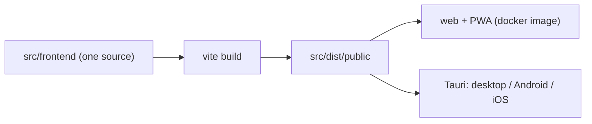

# Single frontend for every platform and OS (PI-014)

> One directory — `src/frontend/` — is the source for the web app, the installable
> PWA, and the Tauri desktop and mobile apps. There is no per-platform frontend and
> no per-OS fork. This document is the reference for how that works and how to
> verify it.

## Layout

```text
src/
├── frontend/            ← THE frontend. Every platform builds from here.
│   ├── src/
│   │   ├── platform/    ← platform model: detect, responsive, pwa, PlatformProvider
│   │   ├── styles/      ← globals.css, tokens.css, platform.css
│   │   ├── components/  pages/  store/  lib/  hooks/
│   │   └── main.tsx     ← the one entry point
│   ├── src-tauri/       ← desktop (Win/macOS/Linux) + Android + iOS shells
│   ├── public/          ← static assets, locales/
│   ├── scripts/         ← offline verifiers (see below)
│   ├── index.html
│   └── vite.config.ts   ← outDir: ../dist/public
├── server/              ← Express + tRPC + SurrealDB
├── shared/              ← types + settings registry, imported by both sides
└── planinc-types/
```

`src/frontend` is declared in the root `package.json` `workspaces` list and named
`@planinc/frontend`. The deploy artifact for **both** stacks is `src/dist/public`:
`vite.config.ts` writes it, `src-tauri/tauri.conf.json` (`frontendDist`) bundles it,
`src/dockerfile` copies it into the image, and `server/index.ts` serves it.



## The platform model

Targets differ in **capabilities**, not in screens. A phone in a browser and a
phone in the Android app want the same layout but can do different things — share
sheet, native back button, safe-area insets, offline shell. So the app asks what
the environment can do instead of branching on `isMobile` everywhere.

| | `platform` | `os` | layout source |
|---|---|---|---|
| Browser tab | `web` | `windows`/`macos`/`linux`/`android`/`ios` | viewport |
| Installed PWA | `pwa` | same | viewport |
| Tauri desktop | `desktop` | `windows`/`macos`/`linux` | viewport |
| Tauri mobile | `android`/`ios` | `android`/`ios` | viewport |

`src/platform/types.ts` holds the model; `detect.ts` resolves it from an injectable
`PlatformEnv` (which is why every row can be verified without a device).

### Capabilities

`capabilities` is the only thing components should branch on, via
`useCapability('nativeShare')`. Ten flags: `windowControls`, `systemTray`,
`nativeShare`, `nativeBack`, `safeAreaInsets`, `serviceWorker`, `localDatabase`,
`nativeFileSystem`, `globalShortcuts`, `nativeTheme`.

Two rules that are enforced rather than trusted:

- **No native shell registers a service worker.** The shells ship their own assets
  and their own updater, so a worker would risk serving a stale bundle past an
  update. `registerOfflineShell()` refuses inside `isNativeShell`, and
  `check-platform.mjs` fails if any shell reports `serviceWorker: true`.
- **`viewport-fit=cover` in `index.html`.** Without it, `env(safe-area-inset-*)`
  resolves to 0 on notched devices and the safe-area support is silently dead.

## Responsive scale (360 → 2560)

One tier list lives in `src/platform/responsive.ts` and is mirrored in
`src/styles/platform.css`; the checker fails if the two disagree.

| tier | min width | card columns | side nav |
|---|---|---|---|
| `xs` | 360 | 1 | no |
| `sm` | 480 | 2 | no |
| `md` | 768 | 2 | **yes** |
| `lg` | 1024 | 3 | yes |
| `xl` | 1280 | 4 | yes |
| `2xl` | 1600 | 4 | yes |
| `3xl` | 1920 | 5 | yes |
| `4xl` | 2560 | 6 | yes |

The `sideNav` column is not decoration — the shell renders the persistent sidebar
from `md` up (that is the width it has always switched at, and iPad portrait is
exactly 768), so `useSideNav()` and `formFactor === 'phone'` agree at the boundary
by assertion.

Layout class (`formFactorFor`) is a viewport fact, not a device fact:
`phone` < 768 ≤ `tablet` < 1024 ≤ `desktop`. The 768 and 1024 boundaries are
asserted to be exactly tiers `md` and `lg`, so the stylesheet and the TypeScript
side cannot disagree at the boundary.

## How adaptation reaches CSS

`PlatformProvider` writes the resolved environment onto `<html>`; `platform.css`
styles off those attributes. There is no prop threading and no JS per component.

| attribute | values |
|---|---|
| `data-platform` | `web` · `pwa` · `desktop` · `android` · `ios` |
| `data-os` | `windows` · `macos` · `linux` · `android` · `ios` · `unknown` |
| `data-form-factor` | `phone` · `tablet` · `desktop` |
| `data-tier` | `xs` … `4xl` |
| `data-pointer` | `fine` · `coarse` |
| `data-native-shell` | `true` · `false` |
| `data-safe-area` | `true` · `false` — from the *capability*, not the form factor |

Read them in React with `usePlatform()`, `useTier()`, `useSideNav()`,
`useIsPhone()`, `useFormFactor()`, `useCapability(name)`, `useIsNativeShell()`.

`useSideNav()` and `useIsPhone()` exist because the app used to ask the same
question in **43 places** (`useMediaQuery('(min-width: 768px)')` ×36 and
`'(max-width: 768px)'` ×8, across 41 files). They are exact complements now; the
old pair was not, since both matched at 768 — which is how the mobile bottom
bar's spacer could render while the bar itself was hidden.

## Remarks & Notes

- **Colour lives in the token contract, not here.** `platform.css` introduces no
  colour literal; `validate-tokens.mjs` fails the build if it ever does.
- **A few literals cannot be CSS variables** — the PWA manifest colours and the
  `<meta name="theme-color">` pair, because the OS draws that chrome before any
  stylesheet exists. `validate-tokens.mjs` check 8 asserts each one still resolves
  to `--background` in the theme it applies to, so they cannot silently rot.
- **The PWA manifest is `orientation: "any"`**, not `portrait`. One build serves
  desktop and landscape tablets; a locked orientation makes the installed
  desktop/tablet app unusable.
- **`runtime/` is a different, older frontend.** `runtime/public` is a
  hand-maintained vanilla JS + Alpine app served by the current `planinc`
  container, and it speaks REST (`/api/notes`) where this app speaks tRPC
  (`/api/trpc`). The two are not interchangeable; see the migration note below.

## Verify it

```bash
cd src/frontend
bun run check:platform     # 12 check groups, 15 environments, 8 tiers, shell wiring
bun run check:contracts    # tokens + settings registry + platform + strict lint
```

`scripts/check-platform.mjs` runs offline against the shipping sources (Node ≥ 22.6
strips the types; `scripts/ts-resolve.mjs` supplies the extensions a bundler would
have resolved) and asserts:

| # | Check | What it proves |
|---|---|---|
| 1 | matrix | 15 environments → expected platform, OS, form factor, tier, capabilities |
| 2 | offline rule | no native shell has a service worker; `main.tsx` probes `__TAURI__` first |
| 3 | capability set | all 10 flags defined on every environment |
| 4 | safe areas | insets on exactly for notch-bearing targets; `viewport-fit=cover` present |
| 5 | tiers | 8 contiguous ascending tiers, 360 → 2560, every boundary and clamp correct |
| 6 | form factor | phone/tablet/desktop boundaries coincide with tiers `md`/`lg` |
| 7 | columns | a preferred column count is clamped to the active tier |
| 8 | css ↔ ts | documented boundaries match `responsive.ts`; every tier has a rule |
| 9 | attributes | every `data-*` the provider writes is styled, and vice versa |
| 10 | wiring | one frontend dir: workspace, vite `outDir`, Tauri, dockerfile, workflow, lockfile |
| 11 | tauri deps | every `@tauri-apps/*` module imported is a declared dependency **and** registered in the Rust shell, and desktop-only plugins stay inside the mobile gate |
| 12 | shell wiring | the layer is *consumed*: every `pi-*` rule has a real consumer, every rendered `pi-*` class is defined, no component keeps a private 768px breakpoint, and no control is hidden behind `hidden group-hover:` (unreachable on touch) |

Add a platform by adding a `CAPABILITIES` row in `detect.ts` **and** a matrix row in
the checker — the capability-set check fails on a half-added target.

## What the shell actually consumes

The layer is not a library sitting next to the UI — `src/components/Layout/*` and
~40 other components read from it:

| Where | Reads | Replaced |
|---|---|---|
| `Layout/index.tsx` | `usePlatform().tier.sideNav` | `useMediaQuery('(min-width: 768px)')` |
| `Layout/Sidebar.tsx` | `usePlatform().tier.sideNav` | its own copy of the same query |
| `pages/*`, `store/*`, 38 components | `useSideNav()` / `useIsPhone()` | 43 queries across 41 files |
| `Layout/index.tsx` header | `.pi-mobile-header` | six inline style properties + a hex from `getFixedHeaderBackground()` |
| `Layout/MobileNavBar.tsx` | `.pi-bottom-bar` | `md:hidden` + an inline blurred style |
| `Layout/Sidebar.tsx` collapse toggle | `.hover-only-on-fine` + `data-reveal` | `opacity-0 group-hover/sidebar:opacity-100` — invisible, so untappable, on a touch tablet |
| `AttachmentRender` overlay icons, `MarkdownRender/Code.tsx`, `PlanincCard` header actions, `aiConversactionList` | `.hover-only-on-fine` + `data-reveal` | `hidden group-hover:block` / `opacity-0 group-hover:…`, plus two `isIOSDevice ? 'opacity-100'` escape hatches that only helped iOS |
| `main.tsx` | `capabilities.serviceWorker`, `capabilities.localDatabase` | offline shell + persistent storage |
| `platform.css` | `data-safe-area` | safe-area padding keyed off the form factor |

**Why the hover reveal matters.** `hidden group-hover:block` means
`display: none` until the pointer hovers — so on a phone or tablet an attachment
could not be downloaded, a code block could not be copied, and a conversation
could not be renamed or deleted. `hover-only-on-fine` keys off `data-pointer`
instead of the device or the OS: a coarse pointer keeps the control visible, a
fine pointer still gets the reveal, and `:focus-visible` covers the keyboard.

## Platform commands

All from `src/frontend`, the single directory:

```bash
bun run dev                  # frontend + backend (Tauri dev shell)
bun run build:web            # web + PWA bundle → src/dist/public
bun run build:no-pwa         # same, without the service worker (what Tauri uses)
bun run tauri:desktop:build  # Windows / macOS / Linux bundles
bun run tauri:android:build  # Android APK/AAB
bun run tauri:ios:build      # iOS
```

## Migration note — `runtime/` → one frontend

The change in this document consolidates the **source** tree: `src/app/` became
`src/frontend/`, and every build, workspace, Tauri, Docker and CI reference was
rewired to it. It does not by itself change what the running container serves.

`runtime/` (the deployed self-contained Express + SurrealDB app with its own
`runtime/public` frontend) and `src/` (this monorepo) are two products that happen
to share a name. Making `runtime/public` a *build output* of `src/frontend` is a
deployment decision with three options:

1. **Serve the built bundle** — add a build stage to `runtime/Dockerfile` that runs
   the frontend build and copies `dist/public` over `runtime/public`. Requires the
   tRPC server (`src/server`) to be what the container runs, since this frontend
   calls `/api/trpc`, not `/api/notes`.
2. **Port the design layer** into `runtime/public` — keep the runtime frontend and
   bring the token contract, registry and appearance layer across.
3. **Keep them separate intentionally** — `src/frontend` for the Tauri/desktop and
   self-hosted React stack, `runtime/` for the current web deployment.

Until one is chosen, treat `runtime/public` as the deployed frontend and
`src/frontend` as the single source for the apps.
