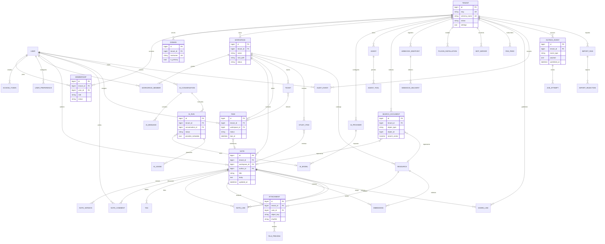

# PlanInc Django server architecture and ERD

**Status:** Architecture baseline complete; implementation slices staged  
**Reference implementation:** Formint Cloud's `core`, `domain`, `handlers`,
`configs`, policy, Bolt API, and task/outbox boundaries  
**PlanInc adaptation:** notes, planning, knowledge graph, files, AI, search,
integrations, collaboration, audit, and analytics

This document is the implementation contract for the isolated
`django_server/`. It does not replace the active TypeScript server until the
data, contract, rollback, and production gates in the other phase plans pass.

## Design principles

1. Resolve tenant scope from the host and authenticated membership. Never accept
   a caller-supplied tenant ID as an authorization boundary.
2. Keep shared identity and tenant registry data separate from tenant-owned
   product data.
3. Put business rules in services and policies. Views, Bolt handlers, Fusion
   fragments, and workers are adapters.
4. Use PostgreSQL transactions for domain writes, Redis for ephemeral work and
   Channels, and an outbox for durable external side effects.
5. Preserve PlanInc use cases and contracts: capture notes quickly, organize
   planning work, link knowledge, import/export safely, search privately, run
   tenant-scoped AI, and integrate through webhooks/MCP/plugins.
6. Keep the client render-first compatible: JSON API, Fusion fragments, and
   WebSockets share the same service layer.

## Target application layout

```text
django_server/
├── config/
│   ├── settings/{base,development,test,production}.py
│   ├── asgi.py
│   ├── routing.py
│   └── urls.py
├── api/
│   ├── bolt_api.py             # versioned typed API assembly only
│   └── errors.py
├── middleware/
│   ├── request_id.py
│   ├── tenant.py
│   └── auth.py
├── apps/
│   ├── health/                 # liveness/readiness
│   ├── tenancy/                # public tenant/domain/membership registry
│   ├── accounts/               # profile, sessions, tokens, preferences
│   ├── workspaces/             # workspace roots, membership roles, sharing
│   ├── notes/                  # notes, tags, comments, history, backlinks
│   ├── planning/               # todos, tasks, categories, tickets, study
│   ├── knowledge/              # resources, relations, graph projections
│   ├── files/                  # attachments, object keys, previews, imports
│   ├── ai/                    # providers, agents, conversations, runs, usage
│   ├── search/                 # indexed documents and permission-aware search
│   ├── integrations/           # RSS, webhooks, plugins, MCP, SSO, shares
│   ├── audit/                  # security events and immutable audit trail
│   ├── analytics/              # read models and product metrics
│   └── operations/             # outbox, jobs, checkpoints, retention
├── domain/
│   ├── policies/               # authorization and tenant predicates
│   ├── services/               # transaction boundaries and use cases
│   ├── events/                 # typed internal events
│   └── ports/                  # storage/provider interfaces
└── tests/
    ├── contracts/
    ├── isolation/
    └── integration/
```

### Responsibilities and integrations

| Boundary | Owns | Integrates with |
| --- | --- | --- |
| `tenancy` | tenant, domain, membership, lifecycle | host resolver, provisioning commands |
| `accounts` | Django user, sessions, access tokens, preferences | auth middleware, audit |
| `workspaces` | roots, roles, invites, shares | tenancy, files, notes, planning |
| `notes` | capture/edit/share/comment/link workflows | workspaces, search, AI, outbox |
| `planning` | todos, tasks, tickets, study/review | notes, workspaces, analytics |
| `knowledge` | resources and graph edges | notes, files, search |
| `files` | upload, extraction, preview, object storage | notes, knowledge, import/export |
| `ai` | provider config, agents, runs, embeddings, usage | notes, search, integrations |
| `search` | projections and query permissions | notes, files, knowledge, analytics |
| `integrations` | RSS, plugins, MCP, webhooks, SSO, public shares | outbox, accounts, notes |
| `audit` | security and change evidence | every mutating service |
| `analytics` | aggregates and dashboards | outbox, domain events |
| `operations` | outbox, jobs, checkpoints, retention | Redis, Channels, storage |

## Complete ERD

The ERD separates public/shared identity from tenant-owned records. Every
tenant-owned table has a `tenant_id` foreign key even when PostgreSQL schema
isolation is enabled. This makes exports, audit queries, and staged SQLite
tests explicit and prevents accidental global query paths.



## Integrated use-case flows

### Capture and knowledge flow

`POST /api/notes` resolves tenant and workspace, checks membership, writes the
note and version in one transaction, emits `note.created` to the outbox, then
workers update search and embeddings. WebSocket subscribers receive a
tenant/workspace-scoped event. The same service is used by Bolt JSON, Fusion
fragments, imports, and MCP.

### Planning flow

Tasks and tickets reference notes or resources but never copy authorization
rules into route handlers. A planning service checks workspace membership,
updates the task, records an audit event, emits `task.changed`, and schedules
analytics through the outbox.

### AI flow

An AI run can read only notes, resources, and search documents visible to the
requesting membership. Provider credentials are decrypted only inside the
provider port, never serialized into API responses. Usage, latency, model, and
failure state are recorded as `AIUsage` and `AuditEvent` rows.

### File and import flow

Uploads receive tenant-prefixed object keys before persistence. Extraction and
preview work is queued with an idempotency key. Imports create an `ImportRun`,
write bounded batches, record rejected rows, and advance a checkpoint only
after the transaction commits.

## Settings contract

Environment settings follow Formint Cloud's split config pattern but use
PlanInc names:

| Setting group | Variables | Production rule |
| --- | --- | --- |
| Runtime | `PLANINC_DJANGO_SECRET_KEY`, `PLANINC_DJANGO_ALLOWED_HOSTS`, `PLANINC_DJANGO_DEBUG` | secret required, debug false |
| Database | `PLANINC_DJANGO_DB_ENGINE`, `PLANINC_DJANGO_DB_NAME`, `PLANINC_DJANGO_DB_HOST`, `PLANINC_DJANGO_DB_PORT` | PostgreSQL required |
| Tenancy | `PLANINC_DJANGO_BASE_HOST`, `PLANINC_DJANGO_ALLOW_TENANT_HEADER` | header disabled publicly |
| Redis | `PLANINC_REDIS_URL`, `PLANINC_CHANNEL_LAYER` | Redis-backed Channels/workers |
| Storage | `PLANINC_OBJECT_STORAGE`, `PLANINC_MEDIA_ROOT`, `PLANINC_MEDIA_BUCKET` | object storage outside development |
| AI | `PLANINC_AI_ENCRYPTION_KEY`, provider-specific secrets | never expose values |
| Observability | `PLANINC_LOG_LEVEL`, `PLANINC_METRICS_ENABLED`, `PLANINC_SENTRY_DSN` | structured logs and alerts |

Settings are layered as `base`, `development`, `test`, and `production`.
Feature flags belong in settings, not in route conditionals:

```text
PLANINC_ENABLE_BOLT_API
PLANINC_ENABLE_CHANNELS
PLANINC_ENABLE_AI
PLANINC_ENABLE_IMPORTS
PLANINC_ENABLE_EXTERNAL_INTEGRATIONS
```

## Implementation order

1. Extract shared `domain/policies`, `domain/services`, and `operations/outbox`
   boundaries around the existing tenancy and notes slice.
2. Add `accounts`, `workspaces`, `planning`, and `files` vertical slices with
   migrations and isolation tests.
3. Add `knowledge`, `search`, `ai`, and `integrations` with provider ports and
   outbox delivery.
4. Add `audit`, `analytics`, and job retry persistence.
5. Generate Bolt/OpenAPI schemas from the same services and add Fusion fragment
   adapters.
6. Run migration rehearsals, client contract tests, and production-like
   rollback checks.

